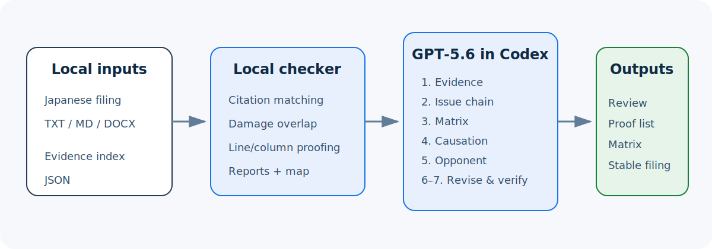

# Evidence-Led Litigation Review

Evidence-Led Litigation Review is a local-first Codex plugin for repeatedly improving Japanese litigation filings. It turns an unstable revision loop into a fixed workflow:

`record inventory → issue chain → exhibit matrix → causation and damages → opponent review → expression → filing gate`

The repository contains only a deliberately fictional case involving `原告A` and `取引相手B`. It contains no real filing, party name, address, case number, medical record, or exhibit image.



## Judge quick test — no build and no API key

Requirements: CPython 3.10 or newer. No third-party package is required.

```bash
python scripts/run_demo.py
```

Expected summary:

```text
draft: working draft | 37/100 | 11 finding(s)
stable: stable candidate | 100/100 | 0 finding(s)
Demo verification passed.
```

Then run the complete automated test suite:

```bash
python -m unittest discover -s tests -v
```

The demo writes Markdown and JSON reports to `sample/output/`. See [Judge quickstart](docs/judge-quickstart.md) for supported platforms, local plugin installation, privacy checks, and the exact Codex test prompt.

The v0.3.1 evidence workflow also runs without an API key or build step because its included sources are plain-text fictional fixtures:

```bash
python scripts/run_workflow_demo.py
```

Expected summary:

```text
workflow: 7 item(s) | 7 event(s) | 11 logic finding(s) | 1 proofreading candidate(s)
Workflow demo verification passed.
```

Run the dedicated location-specific proofreading demo:

```bash
python scripts/run_proofreading_demo.py
```

Expected summary:

```text
proofreading: 1 filing(s) | 7 candidate(s)
Proofreading demo verification passed.
```

## What it does

- Packages a reusable Codex skill for 訴状, 準備書面, 主張書面, 証拠説明書, 上申書, and related filings.
- Reads TXT, Markdown, or DOCX locally using only the Python standard library.
- Converts supported local evidence sources into reusable text dossiers, while keeping a separate original-source verification state.
- Accepts text PDFs through Poppler and image or scanned-PDF OCR through Tesseract when those optional local tools are installed.
- Draws a rising diagonal chronology: facts, causation, contradictions, proof purpose, inference, and legal evaluation on the left; exhibit ID, date, source title, page, and verification state on the right.
- Lists deterministic inconsistency candidates between normalized claims, both parties' filings, and both 甲 and 乙 evidence.
- Lists likely mistypes, registered misconversions, duplicate input, punctuation and bracket defects, unknown exhibits, and explicitly mapped exhibit drift with extracted-text line and column positions.
- Exports the proofreading repair list as Markdown, JSON, and UTF-8 BOM CSV for handoff or filing-day checking.
- Flags unresolved exhibit placeholders and citations missing from the supplied evidence index.
- Detects a common theory error: treating counsel's contractual duty to a client as a direct contract duty to the adverse party.
- Requires a review of the boundary between ordinary advocacy and independently wrongful litigation conduct.
- Separates non-property damage, past lost work, and future lost earnings and warns about period overlap.
- Flags loaded labels so they can be replaced with observable facts and explicit, limited inferences.
- Produces a Markdown report and machine-readable JSON evidence-citation matrix.
- Includes a deterministic first-pass anonymizer and a release privacy scanner.

The checker is triage. It does not decide legal merit, predict a result, authenticate evidence, or replace professional review.

## Two-layer architecture

### 1. Deterministic local checker

`scripts/analyze_filing.py`, `scripts/logic_check.py`, and `scripts/proofread_filings.py` perform repeatable checks and return the same findings for the same inputs. They make no network request and call no model API. This layer is useful for placeholders, numbering, structural omissions, risky expressions, damage-period overlap, literal corrections, exact extracted-text locations, and configured exhibit-citation drift.

### 2. GPT-5.6 reasoning in Codex

The bundled `revise-litigation-filings` skill is the reasoning layer used with GPT-5.6 in Codex. It instructs the model to:

1. state which files and pages were actually read;
2. distinguish direct proof, reasonable inference, disputed allegation, and unverified material;
3. construct the issue chain from chronology through remedy;
4. test factual and legal causation and separate damage periods;
5. steelman the strongest opponent and court concerns;
6. propose wording with an evidence-based reason; and
7. preserve a stable version separately from the filing-day version.

This is intentionally not an API wrapper. GPT-5.6 runs in the Codex session that invokes the skill; the Python checker remains auditable and deterministic. If only the repository demo is run, judges are testing the deterministic layer. If the plugin is invoked in Codex with GPT-5.6, judges are testing the full two-layer workflow.

## How Codex and GPT-5.6 were used

Codex accelerated the repository-level work: plugin structure, Python implementation, DOCX parsing, rule design, tests, synthetic fixtures, documentation, release checks, and repeated validation. The primary product decisions made in the Codex build thread were:

- separate deterministic detection from model judgment;
- score drafting readiness only, never legal merit or probability of success;
- use a fully fictional public case rather than redacted real-case facts;
- make the analyzer dependency-free and local-first; and
- require the strongest anticipated defense before expression polishing.

GPT-5.6 was used meaningfully as the reasoning layer during design and review. It was used to organize the evidence-to-claim chain, distinguish legal duties, test competing causal explanations, separate non-property and property losses, identify non-overlapping loss periods, steelman lawful-advocacy and proof objections, and turn those judgments into the fixed-pass skill. The deterministic findings were then used as inputs to that reasoning rather than represented as legal conclusions.

See [Build log](docs/build-log.md) and [Work created during Build Week](docs/new-during-build-week.md).

## Direct analyzer use

```bash
python scripts/analyze_filing.py \
  --filing sample/input/complaint_draft.txt \
  --evidence sample/input/evidence.json \
  --out sample/output/draft
```

Supported filing inputs are UTF-8 TXT, Markdown, and DOCX. The evidence index is JSON. Use `--strict` when a nonzero exit code is required for critical findings.

## Evidence source workflow

Run the complete fast path:

```bash
python scripts/evidence_workflow.py \
  --manifest sample/workflow/input/manifest.json \
  --out sample/workflow/output \
  --mode fast \
  --ocr-lang eng
```

This generates:

- `intake/evidence-index.md` and one text dossier per source;
- `map/evidence-map.html` and a portable `evidence-map.svg`; and
- `logic/logic-review.md` plus machine-readable JSON; and
- `proofreading/proofreading-review.md`, JSON, and Excel-friendly CSV with line-and-column repair candidates.

For a real local Japanese source set, use `--ocr-lang jpn+eng` after installing Poppler, Tesseract, and Japanese Tesseract language data. Re-run important material in precise mode after opening and checking the original:

```bash
python scripts/evidence_workflow.py \
  --manifest /private/case/manifest.json \
  --out /private/case/review-output \
  --mode precise \
  --ocr-lang jpn+eng
```

Run only the proofreading stage, optionally with a private correction glossary:

```bash
python scripts/proofread_filings.py \
  --index /private/case/review-output/intake/evidence-index.json \
  --out /private/case/review-output/proofreading \
  --rules /private/case/proofreading-rules.json
```

The `source_checked` manifest field records a human source check; the program cannot manufacture that check. If OCR is unavailable or unreliable, supply a reviewed UTF-8 transcript sidecar. The output will keep it explicitly marked as transcript-only until the original is checked. See [Evidence workflow](docs/evidence-workflow.md).

## Use as a Codex plugin

The plugin manifest is `.codex-plugin/plugin.json`; the reusable skill is under `skills/revise-litigation-filings/`. After local installation, start a new Codex thread with GPT-5.6 and use:

> この架空の訴状と証拠索引を読み、ローカルチェッカーを入口に、証拠、論点、因果関係・損害、最強反論、表現、提出前確認の順でレビューしてください。直接立証・推論・争いあり・未立証を分けてください。

The exact installation and verification steps are in [docs/judge-quickstart.md](docs/judge-quickstart.md). Installation only copies the ready plugin into a local Codex marketplace; it does not rebuild the project.

## Privacy and public-release verification

Run both the current-tree and Git-history scan before publishing:

```bash
python scripts/privacy_scan.py --history
```

For a private local check, add exact party names or other forbidden tokens at runtime:

```bash
python scripts/privacy_scan.py --history --deny "PRIVATE_TOKEN"
```

The scanner never stores deny tokens, but automated scanning cannot detect every identifying combination. A manual semantic review remains required. See [PRIVACY.md](PRIVACY.md).

## Supported platforms

- Designed for CPython 3.10+ on macOS, Linux, and Windows.
- Release QA was executed on Linux with Python 3.12.
- `scripts/run_demo.py` is cross-platform.
- `scripts/run_demo.sh` is a convenience wrapper for POSIX shells only.
- No database, container, compiler, package installation, API key, test account, or network service is required for the deterministic demo.

## Repository layout

```text
.codex-plugin/plugin.json        plugin manifest
skills/                          GPT-5.6/Codex review workflow
scripts/analyze_filing.py        deterministic analyzer
scripts/evidence_ingest.py       cached dossiers and original-source gate
scripts/evidence_map.py          diagonal two-sided evidence chronology
scripts/logic_check.py           filing/evidence inconsistency candidates
scripts/proofread_filings.py     line-and-column proofreading repair list
scripts/evidence_workflow.py     one-command workflow orchestration
scripts/anonymize_filing.py      deterministic first-pass redactor
scripts/run_demo.py              cross-platform before/after demo
scripts/run_workflow_demo.py     fictional two-sided workflow demo
scripts/run_proofreading_demo.py fictional proofreading and exhibit-repair demo
scripts/privacy_scan.py          current-tree and Git-history privacy scan
scripts/build_release.py         deterministic clean ZIP builder
sample/                          fully fictional inputs and expected outputs
tests/                           standard-library unit tests
docs/                            judge, build, demo, and submission material
```

## Build Week status

The complete requirement mapping is in [docs/devpost-requirements-matrix.md](docs/devpost-requirements-matrix.md). The [final reporting pack](docs/final-reporting-pack.md) contains the timed demo runbook, judge Q&A, safe-screen list, recording gate, and external publication order. Local engineering and documentation are complete. The public repository URL, public YouTube URL, and `/feedback` Session ID are external submission values and must be inserted immediately before Devpost submission.

## Limitations

- Not legal advice and not a legal-merits engine.
- OCR is not transcription certainty. Japanese OCR requires local Tesseract `jpn` language data, and important material still requires original-source review.
- Legacy `.doc` ingestion is not supported; save as DOCX, PDF, or reviewed UTF-8 text first.
- Automatic annotations cannot establish authenticity, completeness, legal sufficiency, or a causal conclusion.
- Deterministic proofreading cannot find every contextual typo, conversion error, grammatical issue, or legally incorrect expression; line numbers refer to extracted text and must be checked against the editable original.
- No evidence authenticity, completeness, or sufficiency determination.
- Current statutes, court rules, fees, and precedents must be checked against authoritative primary sources at the time of use.
- The analyzer cannot detect all contextual re-identification risks.

## License

MIT. See [LICENSE](LICENSE).
